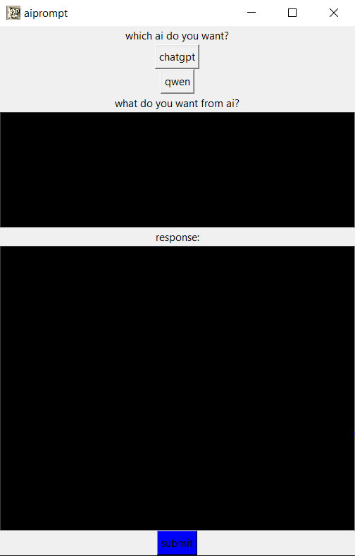

# autoprompt

This project demonstrates how to automate AI-powered workflows using Selenium for browser automation and Tkinter for providing a simple desktop GUI. It allows users to interact with web-based AI tools and automate repetitive tasks with an easy-to-use interface

## Features

- **Selenium Automation:** Automates browser interactions to perform tasks on AI web applications.
- **Tkinter GUI:** Provides a user-friendly graphical interface for configuring and running automations.
- **Customizable:** Easily adapt the code for different websites.
- **Cross-Platform:** Works on Windows
## preview of project

## Requirements

- Python 3.x
- [Selenium](https://pypi.org/project/selenium/)
- [Tkinter](https://docs.python.org/3/library/tkinter.html) (bundled with most Python installations)
- Appropriate WebDriver for your browser (e.g., [ChromeDriver](https://sites.google.com/a/chromium.org/chromedriver/))

## Installation

1. **Clone the repository:**
   ```bash
   git clone https://github.com/automatorplus68-sketch/autoprompt.git
   cd autoprompt
   ```

2. **Install dependencies:**
   ```bash
   pip install selenium
   ```

3. **Download the appropriate WebDriver** new google chrome browser.

## Usage

1. **Run the application:**
   ```bash
   python main.py
   ```

2. **Interact with the GUI:**  
   - Enter the necessary information (e.g.prompt, etc.).
   - Start the automation process by clicking the appropriate button.

3. **Automation:**  
   - The Selenium WebDriver will launch your browser and perform the specified tasks automatically.

## Troubleshooting

- **WebDriverException:** Ensure the correct WebDriver is installed and accessible.
- **Tkinter not found:** If using a minimal Python install, you may need to install Tkinter separately.

## License

This project is licensed under the MIT License.

## Contributing

Pull requests are welcome! For major changes, please open an issue first to discuss what you would like to change.

## Acknowledgements

- [Selenium](https://www.selenium.dev/)
- [Tkinter Documentation](https://docs.python.org/3/library/tkinter.html)
